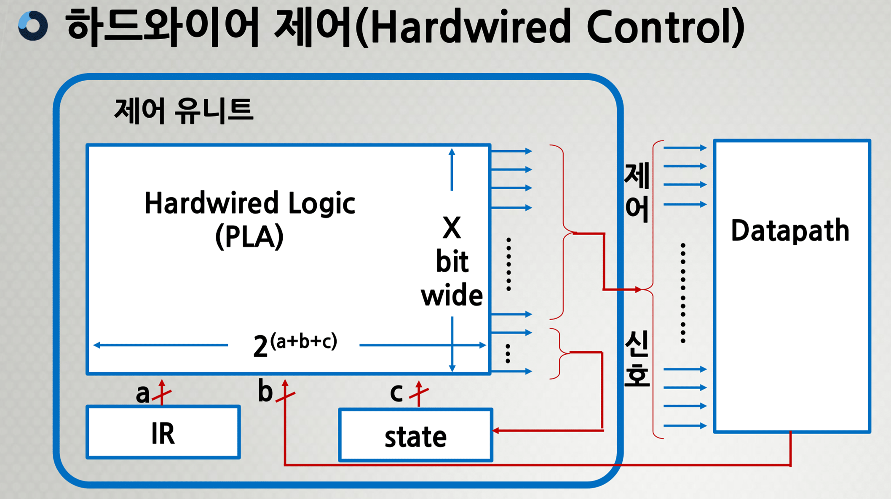
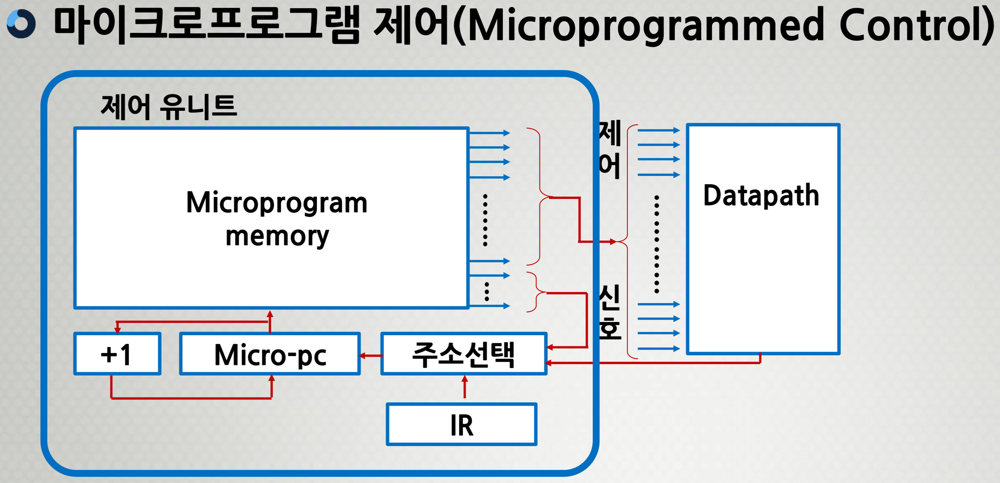
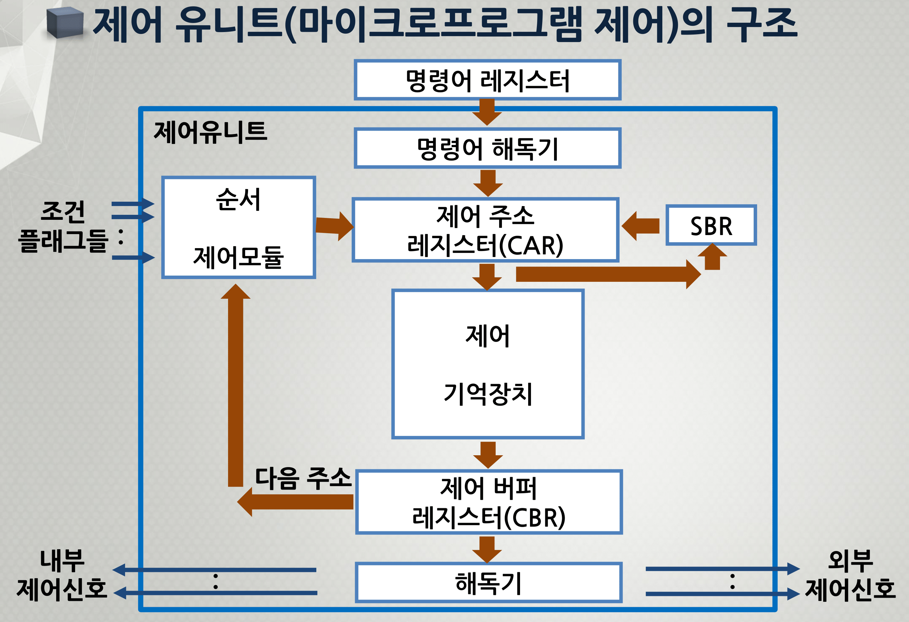

###### CS / [CA](../README.md) / [CU](./ControlUnit.md) / 7주차

# 제어 유니트의 제어 방식과 기능 및 구조

## 하드와이어 제어(Hardwired Control)

#### 등장배경

```
복잡한 Datapath → 복잡한 제어 설계 → 복잡한 프로세서 설계
```

##### _Datapath_

```WIKI
A datapath is a collection of functional units
such as arithmetic logic units or
multipliers that perform data processing operations,
registers, and buses.
```

```
데이터 처리 작업을 수행하는 장치들을 의미한다.
ALU, Multiplier, Register, Bus
```

#### 목표

**_명령어 세트 설계의 단순화 → 제어 과정을 단순화_**

#### 특징

-   제어 유닛은 모든 명령어를 수행함에 있어서
    매 클럭 주기마다 Datapath가 해야 할 일을 정한다.
-   이 과정을 특정화하여 표현한 것이 **_Finite-state diagram_** 이다.
-   각 state 마다 1 클럭 소요되므로 명령어 수행은
    다수의 state로 완료된다.

#### 복잡도 계산

```
Complexity of Control ＝ State × Control inputs × Control output

입력: IR(function) ＋ Datapath(condition) ＋ state의 수
출력: X bit 패턴 구성
```

#### 구조도

<p align=center>
    
</p>

```swift
// S = State
S0 : MAR ← PC
S1 : MDR ← M[MAR], PC ← PC + 1
S2 : IR ← MDR
```

---

## 마이크로프로그램 제어(Microprogrammed Control)

#### 특징

-   제어 유니트는 datapath를 제어하기 위한
    **축소된 컴퓨터**(miniature computer),
    **프로그램 내장형 컴퓨터**(stored-program computer)
-   **_microprogramming_** →
    **_microinstruction, microcode, microprogram_**

#### 방식

-   회로로 제어(하드와이어 제어)하는 것이 아닌
    **비트 패턴을 활용하여 제어**하는 방식이다.
-   제어신호 그룹 → **필드(비트 패턴)** → microinstruction format
-   프로그래밍 → 주소체계 유지, 조건점프 등
-   명령어에 해당되는 각각의 마이크로-연산을 제어 메모리(ROM)의
    할당된 주소에 한 개씩 microcode(비트패턴)로 작성된다.

#### 구조도

<p align=center>
    
</p>

```swift
// A = ROM Address
A0 : MAR ← PC
A1 : MDR ← M[MAR], PC ← PC + 1
A2 : IR ← MDR
```

---

## 제어 유니트의 기능

### 마이크로프로그램 제어

#### 1. 명령어 코드의 해독

#### 2. 해독 후 명령어 실행에 필요한 각종 제어 신호들을 발생

##### 마이크로명령어 _microinstruction_

-   명령어 사이클의 각 주기에서 실행되는
    마이크로-연산에 대응되는 비트들로 이루어진 단어
-   이들은 모두 datapath의 제어신호를 나타냄
-   다음에 수행될 또 다른 마이크로명령어를 결정한다.
-   제어 단어(control word)라도고 불림

##### 마이크로코드 _microcode_

-   마이크로명령어 형식에 따라 각 필드에 2진수로 이루어진 비트패턴

##### 마이크로프로그램 _microprogram_

-   마이크로명령어의 집합
-   명령어 해석기
-   이것은 하드웨어 변경 없이
    컴퓨터 시스템 제어의 수정 가능

##### 마이크로서브루틴 _microsubroutine_

-   공통 루틴 (common routine)
-   마이크로명령어의 그룹 → 인출, 실행, ...
-   하드웨어 비용 감소

---

## 제어 유니트의 구조

<p align=center>
    
</p>

-   명령어 레지스터(IR)로부터 op-code를 받음 (해독 전)
-   명령어 해독기가 op-code를 해독함 (i.e. 001 → LOAD)
-   **_CAR_**(제어 주소 레지스터)은 Control Unit의 PC 역할을 수행
-   **_SBR_**(subroutine register)은 일종의 Stack 역할을 수행

### 명령어 해독기 _Instruction Decoder_

-   명령어 레지스터(IR)로부터 읽혀진 op-code를 해독한다.
-   해독된 연산을 실행하기 위한
    마이크로서브루틴의 시작 주소를 결정한다.

### 제어 주소 레지스터 _CAR_, _Control Address Register_

-   다음 번에 실행할 마이크로명령어의 주소 정보가
    저장되는 레지스터이다.
-   주소는 제어 기억장치의 위치를 말한다.

### 제어 기억장치 _Control Memory_

-   마이크로명령어들로 이루어진 마이크로프로그램을 저장하는
    내부 기억장치(ROM)이다.

### 제어 버퍼 레지스터 _Control Buffer Register_

-   제어 기억장치로부터 읽혀진 마이크로명령어를
    일시적으로 저장하는 레지스터이다.

### 서브루틴 레지스터 _SBR_, _Subroutine Register_

-   마이크로프로그램에서 서브루틴이 호출되는 경우에
    현재의 제어 주소 레지스터(CAR) 내용을
    일시적으로 저장하는 레지스터이다.

### 순서 제어 모듈 _Sequencing Module_

-   마이크로명령어의 실행 순서를 결정하는
    회로들의 집합이다.
