###### CS / [CA](../README.md) / [CU](./ControlUnit.md) / 7주차

# 2. 마이크로프로그램

## 마이크로프로그램

CPU의 명령어 세트 설계 과정에서

-   명령어들의 종류와 비트 패턴을 정의하고,
-   명령어들의 실행에 필요한 하드웨어를 설계하고,
-   각 명령어 실행을 위한 다양한 마이크로서브루틴을 작성한 후,
-   마이크로프로그램 코드들을 **제어기억장치**에 저장한다.

### 제어기억장치

-   CPU 마다 종류가 매우 다양하다.
-   ROM으로 구성된다.
-   ROM의 사이즈는 마이크로명령어 형식에 따라
    마이크로프로그램 크기로 결정된다.

#### 예시

##### 명령어 길이 : 16 bits = op-code(4) + 간접(1) + 즉치 혹은 주소(11)

##### 제어기억장치(ROM) : 2^7 \* 17 bits

##### 마이크로명령어 길이: 17 bits = 연산1(3) + 연산2(3) + 조건(2) + 분기(2) + ADF(7)

-   `연산1`과 `연산2`는 동시에 수행할 수 있다.
-   `ADF`는 주소필드를 의미한다.

<p align=center>
    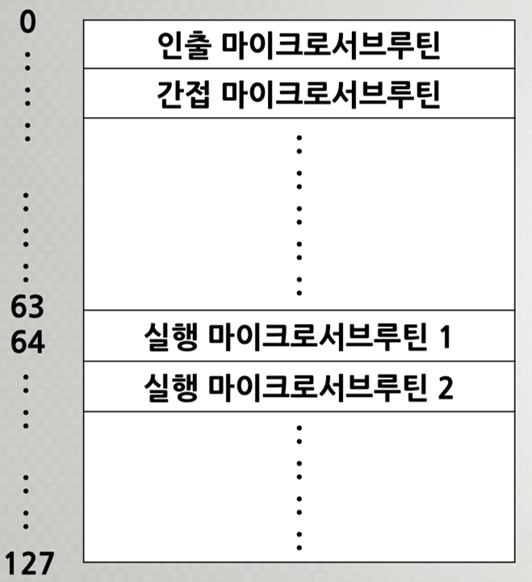
</p>

---

### 1) 마이크로명령어 형식

<p align=center>
    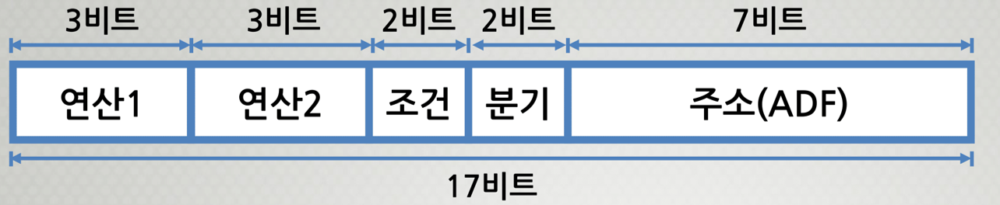
</p>

#### 연산1, 연산2 필드

이 필드들은 두 개의 마이크로명령어들이
동시에 실행될 수 있다는 것을 의미한다.

#### 조건 필드

분기 필드에서 사용될 조건을 명시한다.

#### 분기 필드

분기의 종류를 명시하고, 조건에 따라 다음에 실행될
마이크로명령어의 주소결정방법을 명시한다.

#### 주소 필드

조건에 따라 분기가 발생하는 경우에 분기의 목적지 주소로 사용된다.

> 조건, 분기, 주소는 한 덩어리라고 생각하자.  
> 분기를 하려면 어떤 조건이 필요하고, 분기할 목적지는 주소에 있다.

### 2) 마이크로명령어의 2진 코드와 기호

#### 연산1 필드에 위치할 마이크로-연산

| 코드  | 마이크로-연산    | 기호    |
| :---: | ---------------- | ------- |
| `000` | `None`           | `NONE`  |
| `001` | `MAR ← PC`       | `PCTAR` |
| `010` | `MAR ← IR(addr)` | `IRTAR` |
| `011` | `AC ← AC + MDR`  | `ADD`   |
| `100` | `MDR ← M[MAR]`   | `READ`  |
| `101` | `AC ← MDR`       | `DRTAC` |
| `110` | `IR ← MDR`       | `DRTIR` |
| `111` | `M[MAR] ← MDR`   | `WRITE` |

#### 연산2 필드에 위치할 마이크로-연산

| 코드  | 마이크로-연산   | 기호    |
| :---: | --------------- | ------- |
| `000` | `None`          | `NONE`  |
| `001` | `PC ← PC + 1`   | `INCPC` |
| `010` | `MDR ← AC`      | `ACTDR` |
| `011` | `MDR ← PC`      | `PCTDR` |
| `100` | `PC ← MDR`      | `DRTPC` |
| `101` | `MAR ← SP`      | `SPTAR` |
| `110` | `AC ← AC - MDR` | `SUB`   |
| `111` | `PC ← IR(addr)` | `IRTPC` |

#### 조건 필드에 위치할 마이크로-연산

```text
Uncondition : 조건에 관계없이 무조건 분기
Indirect    : 'I = 1'이면 간접 사이클 루틴 호출
Sign Bit    : 누산기에 저장된 데이터의 부호가 '1'이면 분기
Zero        : 누산기에 저장된 데이터가 '0'이면 분기
```

| 코드 |   조건   | 기호 | 설명                      |
| :--: | :------: | :--: | ------------------------- |
| `00` |   `1`    | `U`  | 무조건 분기               |
| `01` | `I 비트` | `I`  | 간접 주소 지정            |
| `10` | `AC(S)`  | `S`  | AC에 저장된 데이터의 부호 |
| `11` | `AC = 0` | `Z`  | AC에 저장된 데이터 = 0    |

#### 분기 필드에 위치할 마이크로-연산

조건 필드의 내용에 종속되어 있다.
조건이 맞지 않다면 쓰레기값이 된다.

##### JUMP

조건에 따라 `CAR`의 내용을 주소필드(`ADF`)의 값
혹은 `CAR + 1`의 값으로 저장한다.

##### CALL

조건에 따라 `CAR`의 내용을 주소필드(`ADF`)의 값
혹은 `CAR + 1`의 값으로 저장한다.
여기서, 주소필드의 값으로 저장할 때는
복귀할 주소값을 `SBR`에 저장한다.

##### RET

마이크로서브루틴으로부터 복귀
(`SBR`에 저장된 내용을 `CAR`로 적재)

##### MAP

사상방식(mapping)에 의하여 분기 목적지 주소 결정(나중에 다시 다룸)

| 코드 |  기호  | 설명                                                                        |
| :--: | :----: | --------------------------------------------------------------------------- |
| `00` | `JUMP` | `조건 = 1`이면 `CAR ← ADF`<br>`조건 = 0`이면 `CAR ← CAR + 1`                |
| `01` | `CALL` | `조건 = 1`이면 `CAR ← ADF, SBR ← CAR + 1`<br>`조건 = 0`이면 `CAR ← CAR + 1` |
| `10` | `RET`  | `CAR ← SBR` 서브루틴으로부터의 복귀                                         |
| `11` | `MAP`  | `CAR(6) ← "1"`, `CAR(5..2) ← IR(op-code)`, `CAR(1,0) ← "0"`                 |

MAP 방식에서 CAR이 총 7개 비트를 가지고 있다.

```text
    +---+---+---+---+---+---+---+
bit | 6 | 5 | 4 | 3 | 2 | 1 | 0 |
    +---+---+---+---+---+---+---+
CAR | 1 | <- op-code -> | 0 | 0 |
    +---+---+---+---+---+---+---+
```

위와 같은 방식으로 사용되어 특정 위치로 CAR이 이동하게 된다.

### 3) 마이크로프로그램

#### (1) 인출 사이클의 마이크로서브루틴

<p align=center>
    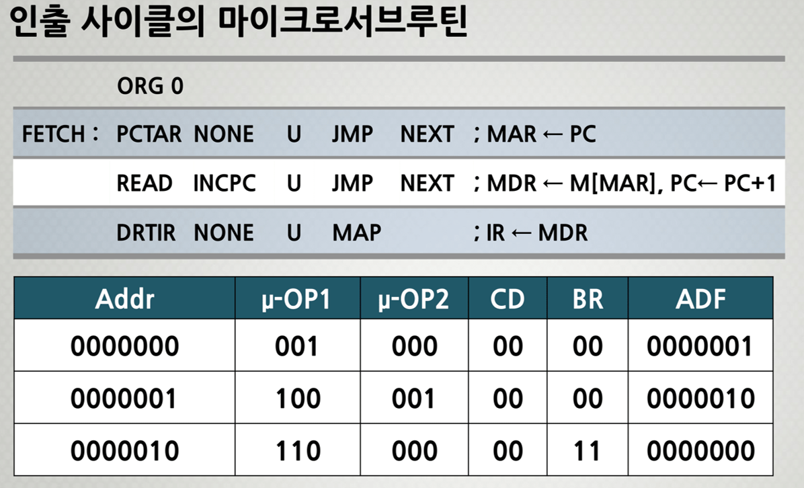
</p>

#### (2) 간접 사이클의 마이크로서브루틴

<p align=center>
    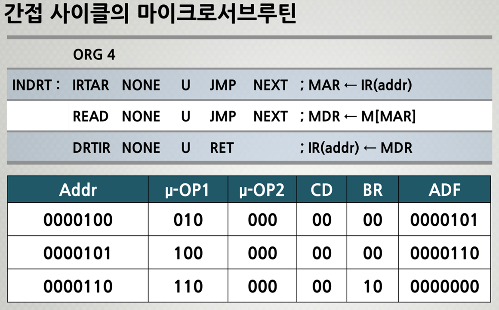
</p>

#### (3) 실행 사이클의 마이크로서브루틴을 찾기 위한 사상(Mapping) 방법

-   명령어 내의 op-code가 지정하는 연산을 실행하기 위하여
    제어기억장치 내에 실행 사이클의 마이크로서브루틴이
    프로그램 되어 있는 **시작 주소를 찾아가는 방법**이다.
-   명령어 op-code의 비트를 **사상함수의 특정 비트 패턴과 조합**하는 방법이다.

<p align=center>
    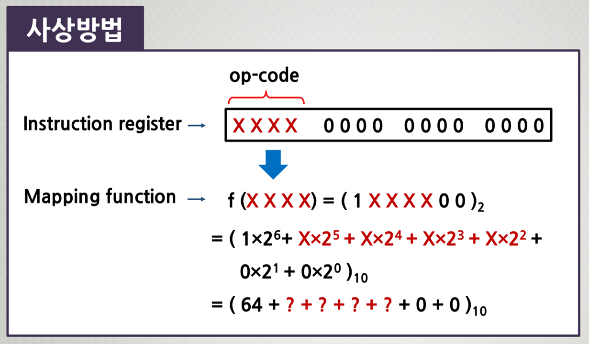
</p>

##### 사상(Mapping) 방법에 따른 실행 사이클의 마이크로서브루틴 주소

<p align=center>
    
</p>

#### (5) 실행 사이클의 마이크로서브루틴

##### `NOP` 명령어

<p align=center>
    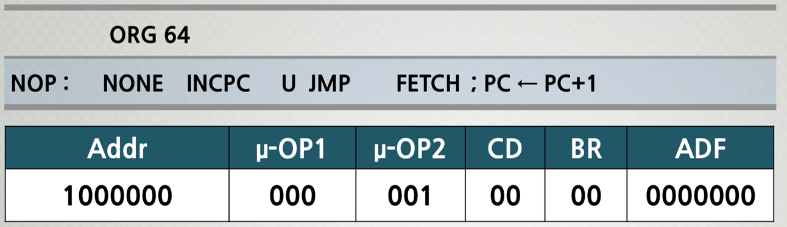
</p>

> 아무것도 안 하는 것처럼 보이지만,
> PC의 값을 1 증가시키고 `FETCH`로 이동한다.

##### `LOAD` 명령어

<p align=center>
    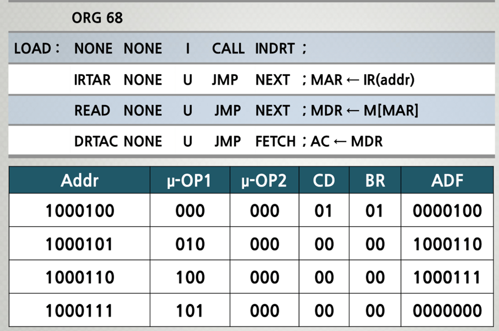
</p>

> `I`는 갑접주소로 갈 것인지 결정한 후, `LOAD`명령을 수행한다.  
> `CAR ← 100(간접사이클 명령어 위치)`,
> `SBR ← CAR + 1`이 생략되어 있다고 볼 수 있다.
> 서브루틴의 `RET`을 만나면 `CAR ← SBR`로 수행되고 돌아온다.

##### `STORE` 명령어

<p align=center>
    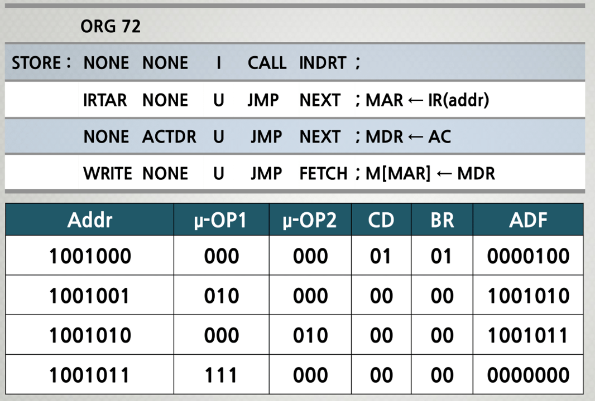
</p>

> `LOAD`연산과 마찬가지로 간접주소를 가는지 판별하고 수행한다.

##### `ADD` 명령어

<p align=center>
    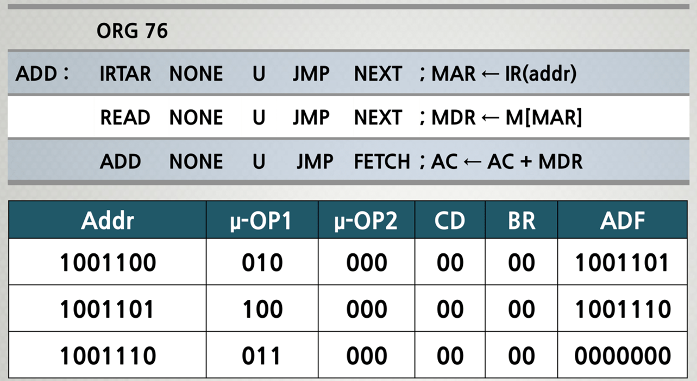
</p>

##### `SUB` 명령어

<p align=center>
    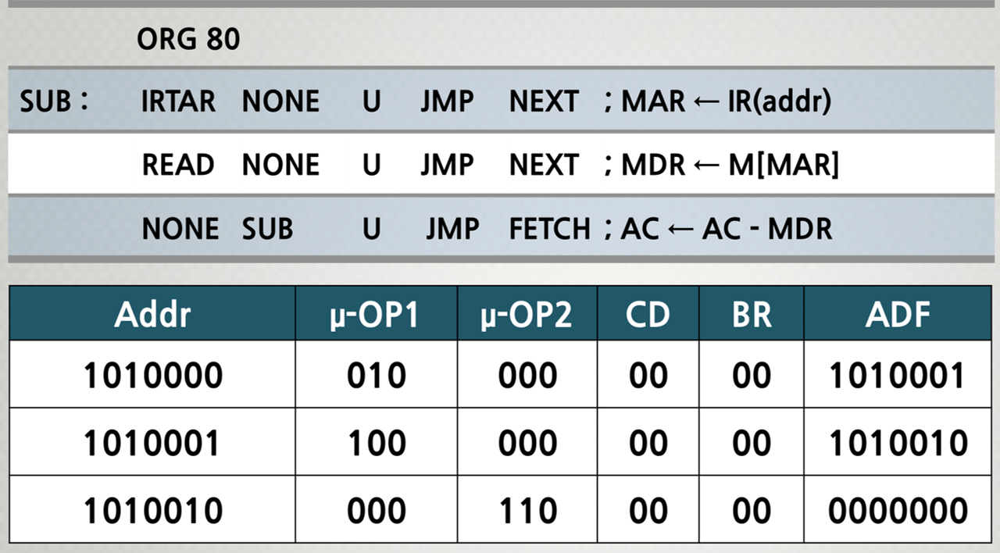
</p>

##### `JUMP` 명령어

<p align=center>
    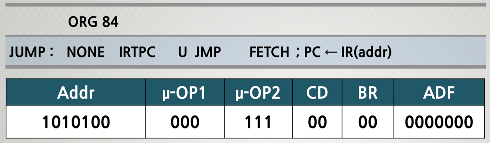
</p>
