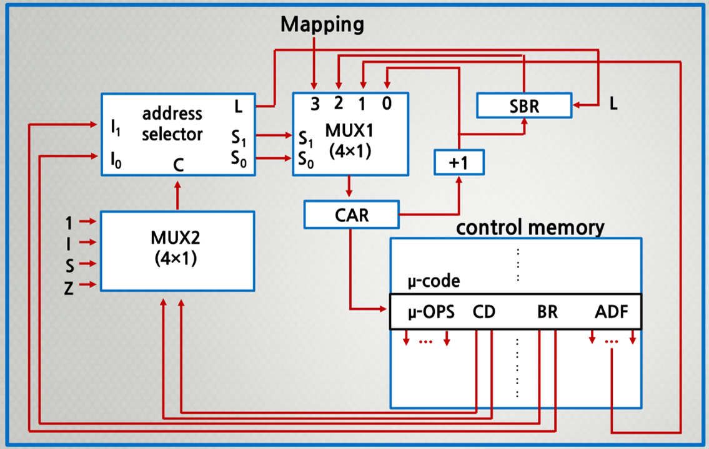
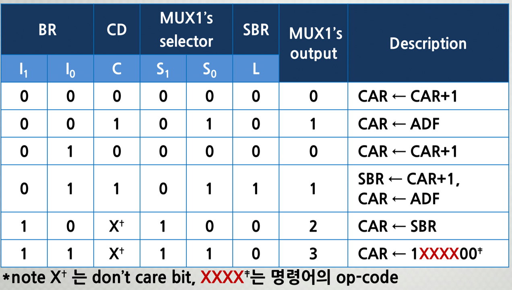
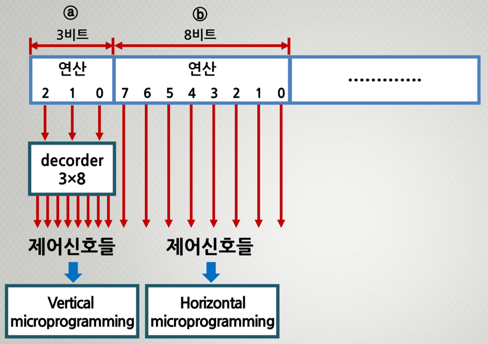

###### CS / [CA](../README.md) / [CU](./ControlUnit.md) / 7주차

# 3. 마이크로프로그램 실행 순서 제어

## 마이크로프로그램 실행 순서 제어 _Sequencing Control_

-   제어 유니트가 **마이크로명령어의 실행을 제어**한다.
-   제어기억장치에 저장된 마이크로명령어들을 작성된
    마이크로프로그램에 따라 **순서대로 인출하는 과정**을 말한다.
-   **_CAR_** 의 초기값(`0, FETCH`)으로 시작해서
    다음 차례에 실행할 마이크로명령어의 주소값을 결정하는 것을 말한다.
-   `MUX1`에서는 다음 차례에 실행될 마이크로명령어의 주소를
    4종류 중에서 마이크로명령어의 조건에 따라 1종류를 선택한다.
-   `MUX2`에서는 분기할 조건을 선택하여
    주소선택회로로 그 값을 전송한다.

> `MUX1` : `JUMP`, `CALL`, `RET`, `MAP`
>
> ##### **_MUX 멀티플렉서_**
>
> 여러 아날로그 또는 디지털 입력 신호 중 하나를 선택하여
> 선택된 입력을 하나의 라인에 전달하는 장치

### 1) 마이크로프로그램의 실행순서제어 과정

#### 순서제어모듈

    

### 2) 제어기억장치의 마이크로명령어의 주소 선택 방법

#### JMP / CALL

-   `C = 0` : 다음 차례의 마이크로명령어 주소를 선택
-   `C = 1` : 주소 필드(`ADF`)가 지정하는 주소로 점프(`JMP`)
    혹은 호출(`CALL`)한다.
-   단, 호출 시에는 원래의 `CAR` 정보를 `SBR`에 저장한다.

#### RET

-   호출한 마이크로명령어의 다음 주소값을 저장하고 있는
    `SBR` 정보를 `CAR`로 전송한다.

#### MAP

-   사상함수의 결과 주소값을 `CAR`에 전송한다.

### 3) 제어장치의 마이크로명령어의 주소 선택 회로의 입력 및 출력 신호

**제어기억장치로부터 읽혀진 마이크로명령어의 연산 필드의 비트들은
모두 각종 CPU 동작을 위한 제어 신호가 된다.**

    

---

## 마이크로명령어의 제어 형식

    

-   **_Vertical micoroprogramming_** 은 해석이 필요
-   **_Horizontal micoroprogramming_** 은 직접 사용

### 1) 수직적(Vertical) 마이크로명령어 제어 형식

마이크로명령어의 연산 필드에 적은 비트 수의
**코드화된**(Encoded) 비트들로 표현하여 제어기억장치의 용량을 줄이고,
**해독기**를 이용하여 원래의 필요한 수 만큼의 제어 신호들로
확장하는 방식이다.

#### 장점

마이크로명령어의 비트 수가 감소한다.

#### 단점

해독 시간 만큼의 지연 시간이 발생한다.

### 2) 수평적(Horizontal) 마이크로명령어 제어 형식

연산 필드의 각 비트 별로 제어 신호를 1:1로 대응시켜 발생하도록 하는
일종의 on/off 스위치 역할을 하여 제어하는 방식이다.

#### 장점

하드웨어가 간단하고, 해독에 따른 지연 시간이 없다.

#### 단점

마이크로명령어 비트 수가 길어지기 때문에
큰 용량의 제어기억장치가 필요하다.

> 시스템의 크기 등의 요소에 따라 전략적으로 선택한다.
