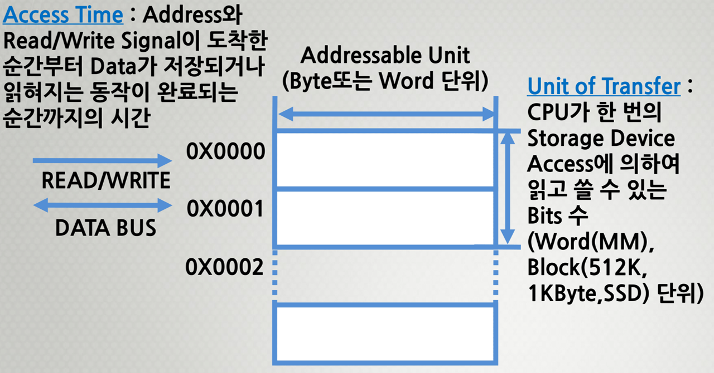
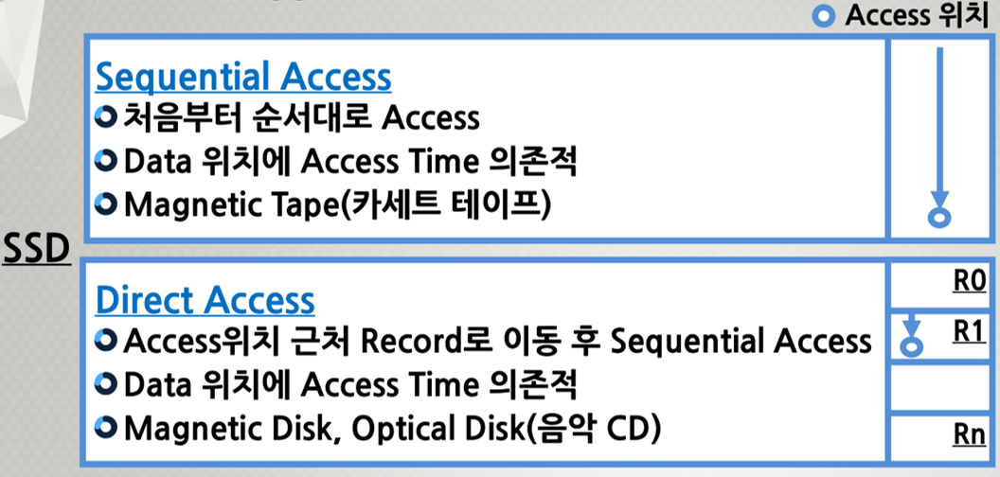
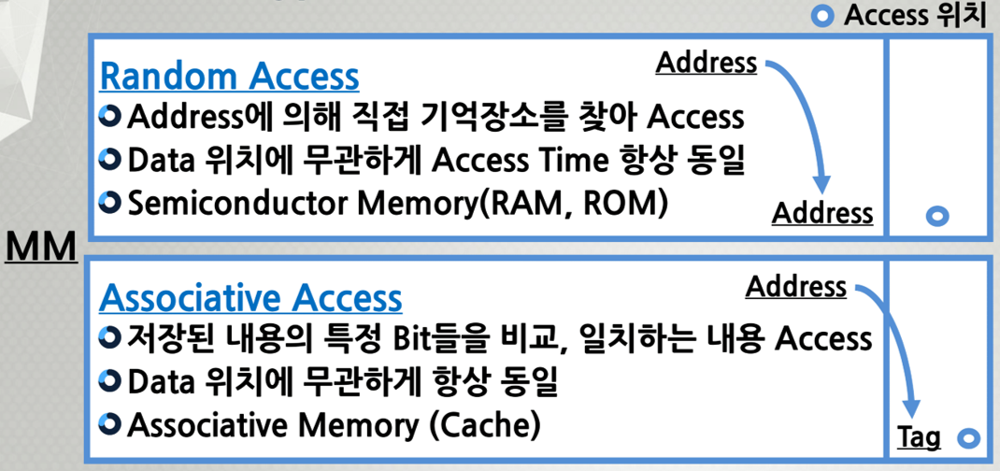
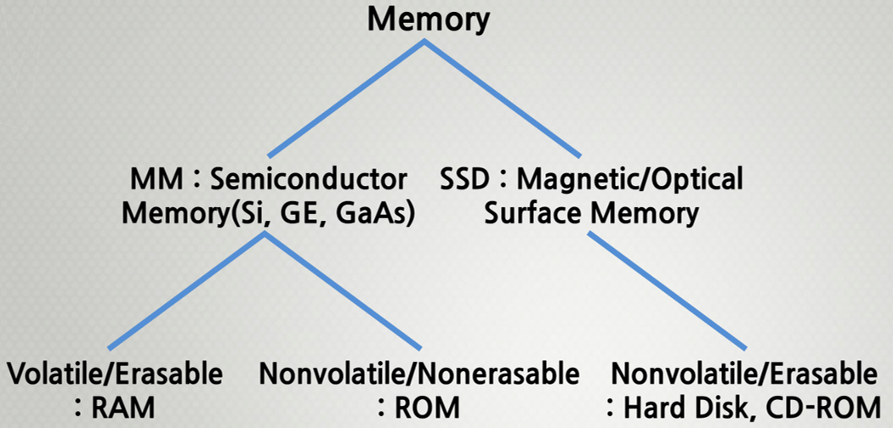
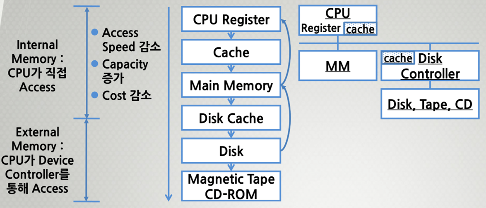

###### CS / [CA](../README.md) / [CU](README.md) / 9주차

# 1. 데이터 저장장치 (Memory + SSD)

## 용어 정리

### Access Time

Address와 Read/Write Signal이 도착한 순간부터
Data가 저장되거나 읽혀지는 동작이 완료되는 순간까지의 시간

### Unit of Transfer

CPU가 한 번의 Stroage Divice Access에 의하여
읽고 쓸 수 있는 Bits 수

> Word(MM), Block(512 k, 1 KByte, SSD) 단위

<p align=center>
    
</p>

### Memory Capacity

```
2^(No. of Address bits) × Addressable Unit
```

### Data Transfer Rate

```
(1/Access 시간 = 초당 Access 되는 횟수) × (한 번에 읽혀지는 Data Bits 수)
```

### Example

```
Access Time = 100 ns 이고, Access 단위 = 32 bits인 경우
Data 전송률 = (1/100 ns) × 32 = 320 MBits/sec
```

---

## Access Type

### SSD

#### Sequential Access

-   처음부터 순서대로 Access
-   Data 위치에 Access Time 의존적
-   Magnetic Tape(카세트 테이프)

#### Direct Access

-   Access 위치 근처 Record로 이동 후 Sequential Access
-   Data 위치에 Access Time 의존적
-   Magnetic Disk(Hard Disk), Optical Disk(CD)

<p align=center>
    
</p>

### MM

#### Random Access

-   Address에 의해 직접 기억장소를 찾아 Access
-   Data 위치에 무관하게 Access Time 항상 동일
-   Semiconductor Memory(RAM, ROM)

#### Associative Access

-   저장된 내용의 특정 Bit들을 비교, 일치하는 내용 Access
-   Data 위치에 무관하게 항상 동일
-   Address와 Tag가 연관되어 있으면 접근
-   Associative Memory(Cache)

> Associative : 연관

<p align=center>
    
</p>

---

## Memory 유형

### Storage

1. MM
    1. RAM
    2. ROM
2. SSD
    1. Hard Disk
    2. CD-ROM

<p align=center>
    
</p>

### MM - Semiconductor Memory / 반도체

-   Si : Silicon 실리콘
-   Ge : Germanium 저마늄(게르마늄)
-   GaAs : gallium arsenide 비소화 갈륨
-   #### Volatile/Erasable : RAM
    -   휘발성 / 지울 수 있음
-   #### Nonvolatile/Nonerasable : ROM
    -   비휘발성 / 지울 수 없음

> 예외 : USB는 Flash Memory로 지웠다가 사용할 수 있다.

### SSD - Magnetic/Optical Surface Memory

-   Surface Memory : 표면을 갖는 메모리
-   #### Nonvolatile/Erasable : Hard Disk, CD-ROM
    -   비휘발성 / 지울 수 있음

---

## Memory Hierarchy

<p align=center>
    
</p>

### Principle of Locality

-   Menory의 Access가 몇몇 특정 영역에 집중되는 현상
-   짧은 시간을 기준으로 보면
    Processor가 Memory에 한정된 위치들만을 Access 하면서 작업을 수행
-   이 원리가 적용되는 데이터에 대해 Hierarchy Memory를 사용할 경우
    최저 비용으로 최고 성능을 얻을 수 있음

### Hierarchical Memory System

-   Memory의 성능 대 가격비(Performance/Cost Ratio)를 향상시키기 위해
    한 System 내에 다양한 Memory들을 사용하는 방식
    -   CPU에서 가까운 Memory :  
        속도가 빠르나, 가격이 높은 Memory 사용
    -   CPU에서 먼 Memory :  
        속도가 느리나, 가격이 낮은 Memory 사용
-   #### 효과 : Average Access Time이 빨라짐
    -   Main Memory의 Access 시간 = `50 ns`
    -   Secondary Storage Device의 Access 시간 = `500 ns`
    -   Access 할 정보가 Main Memory에 있을 확률 = `50 %`
    -   Average Memory Access Time =  
        `(0.5 × 50 ns) + (0.5 × 500 ns) = 275 ns`
    -   Data가 Main Memory에 있는 비율에 따른
        Average Access Time의 변화
        
